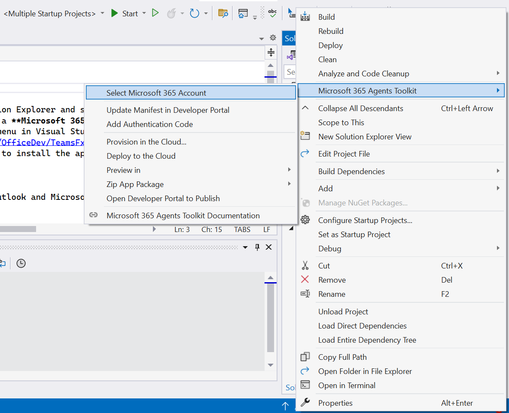
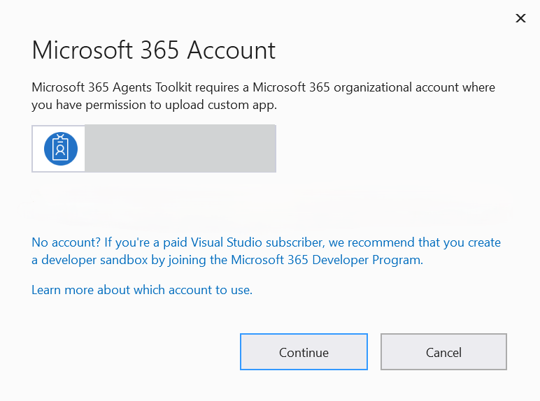
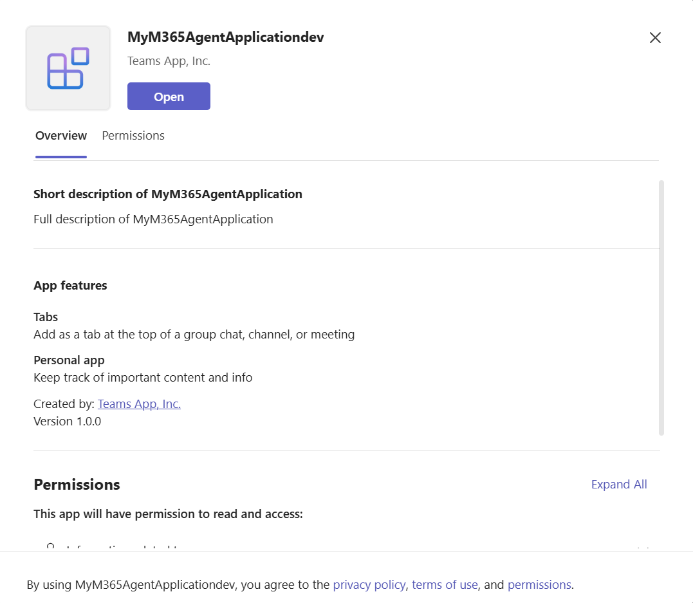
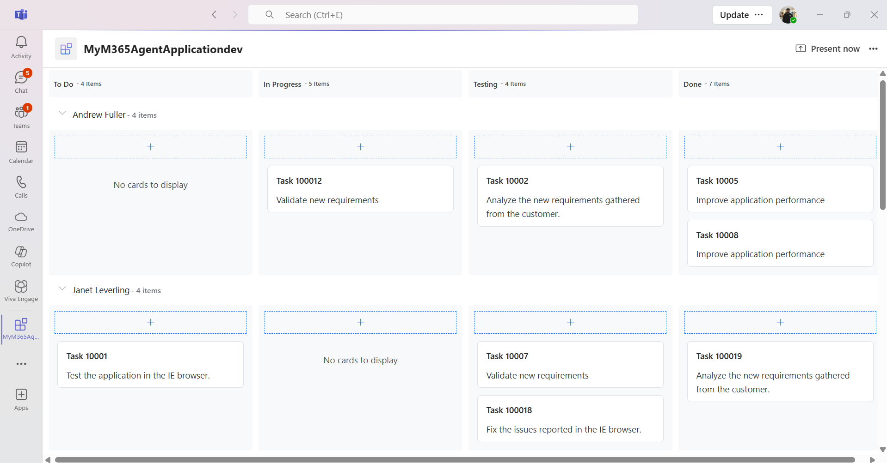

# Building-Apps-for-Microsoft-Teams-with-Blazor-using-Syncfusion-Components
This example showcases a simple App for Microsoft Teams with Syncfusion Blazor Components.

## Overview

This section explains how to  run the first Microsoft Teams application (MSTeams App) with Syncfusion&reg; Blazor components.

## Prerequisites

* Visual Studio 2022 [> 17.13 version] with the required work loads (Visula studio Installer -> Workloads -> ASP.NET and web development -> Select Microsoft Teams development tools from option check list).

* Microsoft Team Application - Enable side loading for testing the application.

* Microsoft Edge or Google Chrome browser with developer tools.

## How to Run?

1. To configure the project with the Microsoft teams application, right Click on the M365 Agent Project and Select Microsoft M365 Account.

2. After configuring successfully, it displays the window with Microsoft 365 Account. If you already have an account Select the available Office 365 account and click on continue. If you dont have account, create a new account and add the newly created account and click on continue.

3. After successful login. Click on Debug -> Start Debugging or click on F5 to run the application.

4. Once the application is build successfully, prompts the output window with create MyTeamsApp application. Click on Add in the created application

5. On clicking on "Open" the new Microsfot application with personal Tab is created.

## Support and feedback

* For any other queries, reach our [Syncfusion support team](https://www.syncfusion.com/support/directtrac/incidents/newincident) or post the queries through the [Community forums](https://www.syncfusion.com/forums) and submit a feature request or a bug through our [Feedback portal](https://www.syncfusion.com/feedback).
* To renew the subscription, click [renew](https://www.syncfusion.com/sales/products) or contact our sales team at salessupport@syncfusion.com | Toll Free: 1-888-9 DOTNET.

## License

Syncfusion  Blazor Components is available under the Syncfusion Essential Studio program, and can be licensed either under the Syncfusion Community License Program or the Syncfusion commercial license.

To be qualified for the Syncfusion Community License Program, you must have gross revenue of less than one (1) million U.S. dollars (USD 1,000,000.00) per year and have less than five (5) developers in your organization, and agree to be bound by Syncfusion’s terms and conditions.

Customers who do not qualify for the community license can contact sales@syncfusion.com for commercial licensing options.

You may not use this product without first purchasing a Community License or a Commercial License, as well as agreeing to and complying with Syncfusion's license terms and conditions.

The Syncfusion license that contains the terms and conditions can be found at
[https://www.syncfusion.com/content/downloads/syncfusion_license.pdf](https://www.syncfusion.com/content/downloads/syncfusion_license.pdf)

## About Syncfusion

Founded in 2001 and headquartered in Research Triangle Park, N.C., Syncfusion has more than 29,000 customers and more than 1 million users, including large financial institutions, Fortune 500 companies, and global IT consultancies.

Today we provide 1,800+ controls and frameworks for web ([ASP.NET Core](https://www.syncfusion.com/aspnet-core-ui-controls), [ASP.NET MVC](https://www.syncfusion.com/aspnet-mvc-ui-controls), [ASP.NET WebForms](https://www.syncfusion.com/jquery/aspnet-web-forms-ui-controls), [JavaScript](https://www.syncfusion.com/javascript-ui-controls), [Angular](https://www.syncfusion.com/angular-ui-components), [React](https://www.syncfusion.com/react-ui-components), [Vue](https://www.syncfusion.com/vue-ui-components), and [Blazor](https://www.syncfusion.com/blazor-components), mobile ([Xamarin](https://www.syncfusion.com/xamarin-ui-controls), [Flutter](https://www.syncfusion.com/flutter-widgets), [UWP](https://www.syncfusion.com/uwp-ui-controls), and [JavaScript](https://www.syncfusion.com/javascript-ui-controls)), and desktop development ([WinForms](https://www.syncfusion.com/winforms-ui-controls), [WPF](https://www.syncfusion.com/wpf-ui-controls), and [UWP](https://www.syncfusion.com/uwp-ui-controls) and [WinUI](https://www.syncfusion.com/winui-controls))). We provide ready-to deploy enterprise software for dashboards, reports, data integration, and big data processing. Many customers have saved millions in licensing fees by deploying our software
